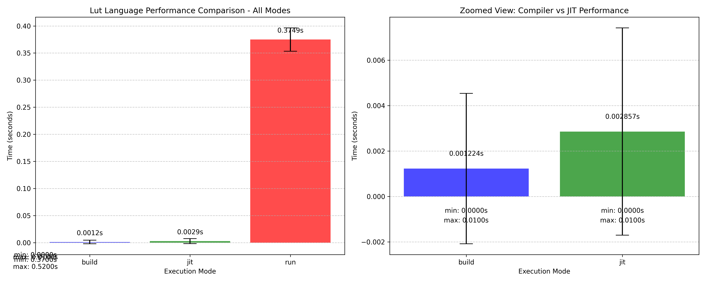

# Lüt Language Performance Benchmarks

This document contains benchmark results comparing the performance of Lüt language's three execution modes:
- **Interpreter mode** (`lut run`)
- **Compiler mode** (`lut build`)
- **JIT mode** (`lut jit`)

## Benchmark Setup

The benchmark tests the performance of recursive factorial calculations in a loop:

```lua
-- Recursive factorial function
func pub factorial { n : number ! } [
    -- Base case: 0! and 1! are both 1
    if { $n <= 1 } [
        1
    ] else [
        -- Recursive case: n! = n * (n-1)!
        $n * call { factorial, $n - 1 }
    ]
]

-- More intensive version - calculate multiple factorials repeatedly
iterations : 100000  -- Increased iterations for more substantial work
max_factorial : 20   -- Calculate factorial up to this number
result : 0

print { 'Running ', $iterations, ' factorial calculations' }

for { i : 0, $i + 1, $i < $iterations } [
    -- Calculate a different factorial each time
    n : $i % $max_factorial + 1  -- Values 1 to max_factorial
    result : call { factorial, $n }
]

print { 'Final factorial result: ', $result }
```

Each execution mode was run 50 times to get statistically significant results (After about 50 the results are basically the same so there was no need to run 100, 1000 times etc. // I will continue to run more intensive benchmarks in the future).

## Performance Results

The benchmark results show significant performance differences between the three modes:

| Mode        | Average Time (s) | Min Time (s) | Max Time (s) |
|-------------|------------------|--------------|--------------|
| Interpreter | 0.3749           | 0.37         | 0.52         |
| Compiler    | 0.0012           | 0.00         | 0.01         |
| JIT         | 0.0029           | 0.00         | 0.01         |

## Performance Comparison

The compiler and JIT modes provide significant speedups compared to the interpreter:

- **Compiler mode**: ~306x faster than the interpreter
- **JIT mode**: ~131x faster than the interpreter

## Visual Results



## Running the Benchmarks

To run the benchmarks yourself:

1. Ensure you have Python 3 with pandas and matplotlib installed
2. Run the benchmark script: `./benchmark.sh`
3. Generate the plots: `python3 benchmark.py`

The benchmark script performs 50 runs of each execution mode and saves the results to CSV files. The plotting script generates visualization of the performance differences.

## Conclusions

- Both the compiler and JIT modes offer dramatic performance improvements over the interpreter mode
- The compiler mode is currently faster than the JIT mode, likely due to the overhead of JIT compilation
- For factorial calculations (and likely similar recursive functions), the compiled mode offers the best performance

These benchmarks demonstrate the value of Lüt's multi-mode execution approach, allowing users to choose between interpreter flexibility and compiled performance based on their needs.
