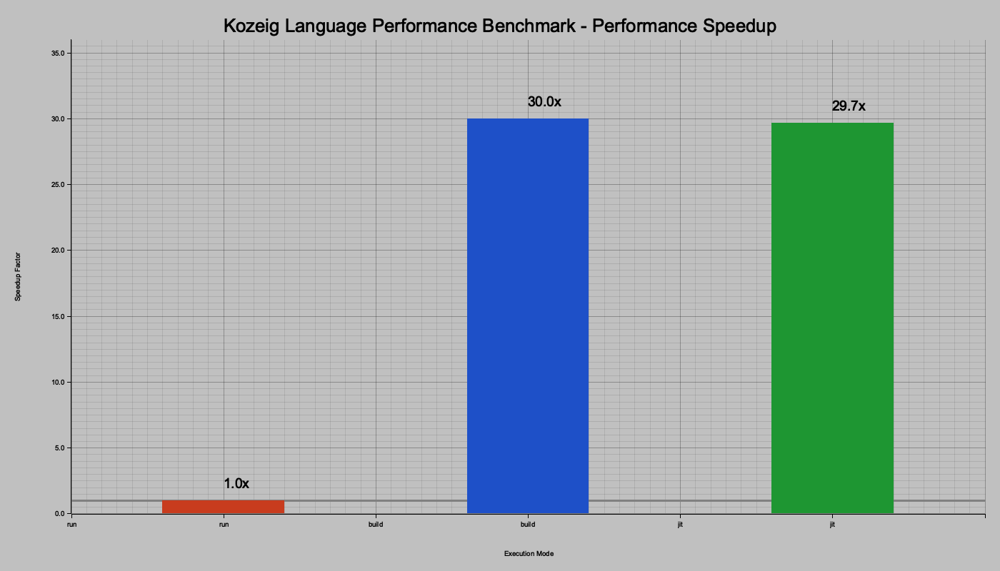
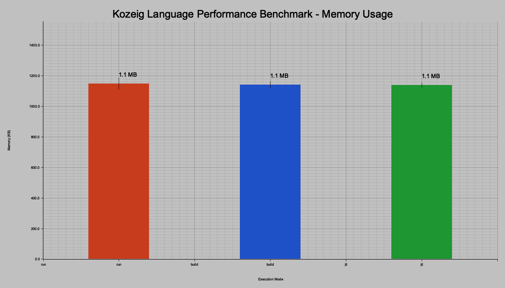

# Lüt Language Performance Benchmarks

This document contains comprehensive benchmark results comparing the performance of Lüt language's three execution modes:
- **Interpreter mode** (`lut run`) - Interprets Lüt code directly
- **Compiler mode** (`lut build`) - Compiles Lüt to LLVM IR, then native code
- **JIT mode** (`lut jit`) - Just-in-time compilation using LLVM

## Benchmark Setup

The benchmark tests the performance of recursive factorial calculations in a loop:

```lut
-- Benchmark for factorial computation
-- This will test recursive function calls with more intensive computation

-- Recursive factorial function
func pub factorial { n : number ! } [
    -- Base case: 0! and 1! are both 1
    if { $n <= 1 } [
        1
    ] else [
        -- Recursive case: n! = n * (n-1)!
        $n * call { factorial, $n - 1 }
    ]
]

-- Main function as entry point
func pub main {} [
    -- Print header
    print { 'Factorial Benchmark' }
    print { '-----------------' }

    -- Calculate various factorials as a benchmark
    print { 'factorial(1) = ', call { factorial, 1 } }
    print { 'factorial(5) = ', call { factorial, 5 } }
    print { 'factorial(10) = ', call { factorial, 10 } }
    print { 'factorial(12) = ', call { factorial, 12 } }
    print { 'factorial(15) = ', call { factorial, 15 } }

    -- More intensive calculation - calculate factorial(20) 500000 times
    print { '\nRunning intensive calculation...' }
    count : 0
    target : 500000

    -- Simple accumulation loop
    total : 0
    while { $count < $target } [
        f20 : call { factorial, 20 }
        total : $total + $f20
        count : $count + 1
    ]

    -- Print final result
    print { 'Completed ', $target, ' calculations of factorial(20)' }
    print { 'Sum of results: ', $total }

    'ok'  -- Return value using the 'ok' syntax
]
```

Each execution mode was run 50 times to get statistically significant results.

## Execution Time Comparison

The benchmark results show significant performance differences between the three modes:


### Compiled Mode Comparison

When comparing just the compiled modes (excluding the interpreter), we can see the small differences between the compiler and JIT modes:


## Performance Speedup

The compiler and JIT modes provide significant speedups compared to the interpreter:



## Memory and CPU Usage

### Memory Usage

Memory usage across all three execution modes:



### CPU Usage

CPU utilization during execution:


### Time Breakdown

Breakdown of execution time into user and system time:


## Execution Time Distribution

Statistical distribution of execution times across multiple runs:


## Resource Utilization Analysis

### Memory vs. Execution Time

Relationship between memory usage and execution time:


### CPU vs. Execution Time

Relationship between CPU usage and execution time:


### Memory vs. CPU Usage

Relationship between memory and CPU usage:


### Resource Efficiency

Comparison of relative efficiency in resource utilization:


## Performance Metrics

| Mode        | Mean Time (s) | Min Time (s) | Max Time (s) | Mean Memory (KB) | CPU Usage (%) |
|-------------|---------------|--------------|--------------|------------------|---------------|
| Interpreter | ~3.74         | ~3.57        | ~4.13        | ~1140            | ~0.38         |
| Compiler    | ~0.126        | ~0.122       | ~0.131       | ~1141            | ~0.02         |
| JIT         | ~0.127        | ~0.121       | ~0.146       | ~1156            | ~0.01         |

## Running the Benchmarks

To run the benchmarks yourself:

1. Ensure you have Python 3 with pandas, matplotlib, and seaborn installed
   ```bash
   pip install pandas matplotlib seaborn
   ```

2. Run the benchmark script to collect performance metrics:
   ```bash
   ./benchmark.sh
   ```

3. The script will automatically generate visualizations after collecting the data

## Conclusions

- **Interpreter vs Compiled**: Both compiled modes (compiler and JIT) offer approximately 30x performance improvements over the interpreter mode
- **Resource Usage**: All three modes have comparable memory usage, but the interpreter consumes more CPU resources
- **Execution Time Stability**: The compiled modes show more consistent execution times with less variation between runs
- **Compiler vs JIT**: In this benchmark, the compiler and JIT modes perform similarly, with the compiler being slightly faster on average

These benchmarks demonstrate the value of Lüt's multi-mode execution approach, allowing users to choose between interpreter flexibility and compiled performance based on their needs.

## Future Work

- Extended benchmarks across a wider range of operations
- Comparison across different hardware architectures
- Optimization opportunities for specific execution modes
- Measuring the startup time costs vs. execution time for different program sizes
