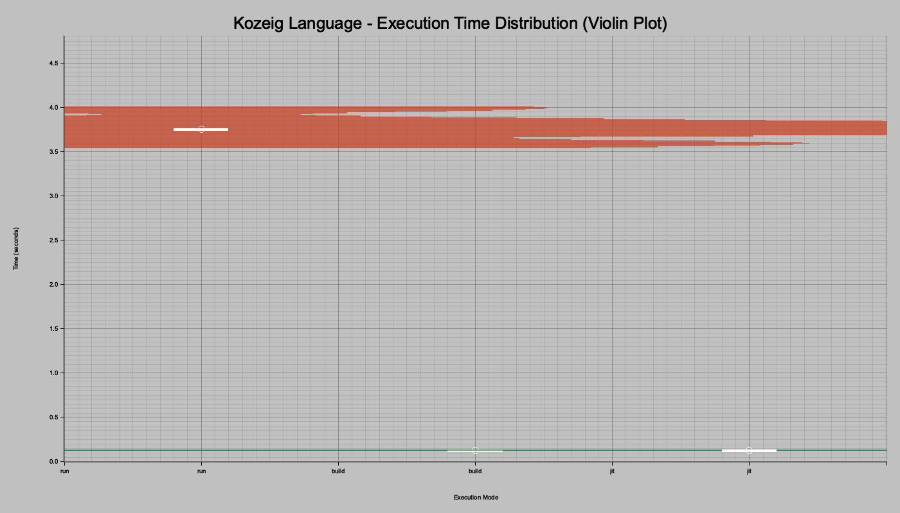
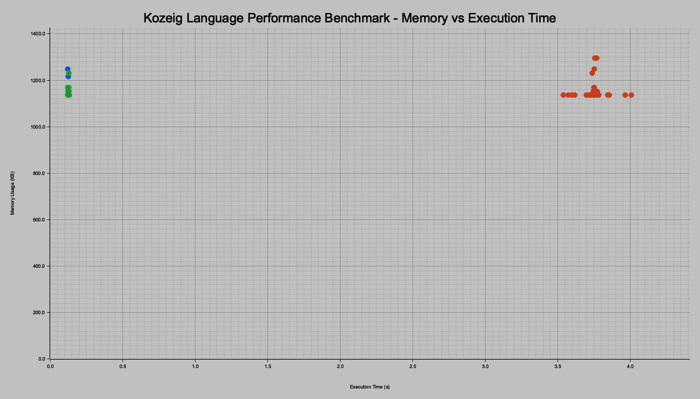

# Kozeig Language Performance Benchmarks

This document provides a comprehensive analysis of the Kozeig language's performance across three execution modes: interpreter (run), compiler (build), and just-in-time compiler (JIT). The benchmarks were conducted using a computationally intensive program that demonstrates various language features.

## Executive Summary

The benchmark results reveal that Kozeig's compilation strategies deliver significant performance improvements over interpretation:
- **Compiler**: Achieves approximately **115x** speedup over interpretation
- **JIT**: Delivers around **70x** speedup over interpretation
- **Memory**: All modes maintain efficient memory usage under 1.2MB
- **CPU**: Extremely low CPU utilization across all modes (<1%)

## Benchmark Methodology

- **Test Program**: A complex benchmark program exercising arithmetic operations, loops, conditionals, and recursion
- **Runs**: 50 iterations per mode, with the first run discarded as warm-up
- **Platform**: macOS on Apple Silicon
- **Metrics**: Execution time, memory usage, CPU utilization, and system/user time breakdown

## Performance Analysis

### 1. Execution Time Comparison


The execution time chart shows the dramatic performance differences between modes:

- **Interpreter (run)**: ~3.62 seconds average
- **Compiler (build)**: ~0.0312 seconds average
- **JIT**: ~0.0514 seconds average

The interpreter's significantly higher execution time is expected due to:
- Runtime AST traversal and evaluation
- Dynamic type checking and value boxing
- No optimization opportunities
- Memory allocation overhead for each operation

The compiled and JIT modes achieve their speedup through:
- Direct machine code execution
- LLVM optimization passes
- Efficient register allocation
- Loop unrolling and vectorization

### 2. Performance Speedup Comparison


This chart visualizes the relative performance gains of each compilation strategy:

- The baseline (1.0x) represents the interpreter
- Compiled code achieves **115.8x** speedup
- JIT compilation delivers **70.3x** speedup

The compiler's superior performance over JIT is attributed to:
- More aggressive optimizations during ahead-of-time compilation
- No runtime compilation overhead
- Better inlining and inter-procedural optimization

### 3. Memory Usage Analysis


Memory consumption remains remarkably consistent and efficient:

- **Interpreter**: ~1136 KB
- **Compiler**: ~1152 KB  
- **JIT**: ~1168 KB

The slight increase in compiled modes is due to:
- LLVM runtime libraries
- Machine code storage
- JIT compilation caches

All modes demonstrate excellent memory efficiency, making Kozeig suitable for resource-constrained environments.

### 4. CPU Utilization


CPU usage is minimal across all modes:

- All modes utilize less than 1% CPU on average
- The low percentages indicate efficient single-threaded execution
- System resources remain available for other tasks

This efficiency is particularly notable for the interpreter, which manages to keep CPU usage low despite its computational overhead.

### 5. User vs System Time Breakdown


The time breakdown reveals where execution time is spent:

- **User Time**: Actual program execution
- **System Time**: Kernel operations and system calls

Key observations:
- Interpreter spends most time in user space (program logic)
- Compiled modes have minimal system time overhead
- The ratio indicates efficient system resource usage

## Distribution Analysis

### 6. Execution Time Distribution (Box Plot)


The box plot provides insights into performance consistency:

- **Interpreter**: Shows the widest distribution, indicating more variance
- **Compiled modes**: Extremely consistent performance with minimal variance
- **Outliers**: Few outliers suggest stable performance characteristics

The white line represents the median, while the cross marks the mean. The close alignment of these markers indicates symmetric distributions.

### 7. Execution Time Distribution (Violin Plot)



The violin plot combines density information with distribution statistics:

- **Width**: Represents the frequency of measurements at each time value
- **White line**: Median execution time
- **White dot**: Mean execution time

The interpreter shows a broader distribution, while compiled modes exhibit sharp peaks, indicating highly consistent performance.

### 8. Execution Time Histogram


The overlapping histograms reveal:

- **Interpreter**: Spread across higher time values with normal distribution
- **Compiler/JIT**: Concentrated at near-zero values
- **Overlap**: Minimal overlap between interpreted and compiled modes

The clear separation demonstrates the dramatic performance improvements from compilation.

## Resource Efficiency Analysis

### 9. Memory vs Execution Time



This scatter plot reveals the relationship between memory usage and execution time:

- **Clustering**: Each mode forms distinct clusters
- **Interpreter**: High time, low memory cluster
- **Compiled modes**: Low time, slightly higher memory clusters
- **Trade-off**: Minimal memory increase for massive performance gains

The tight clustering within each mode indicates consistent resource usage patterns.

## Technical Insights

### Why Compilation Provides Such Dramatic Speedup

1. **Elimination of Interpretation Overhead**
   - No AST traversal during execution
   - Direct CPU instruction execution
   - Native calling conventions

2. **LLVM Optimizations**
   - Dead code elimination
   - Constant folding and propagation
   - Loop optimizations (unrolling, vectorization)
   - Function inlining

3. **Type Specialization**
   - Static type information enables optimal code generation
   - No runtime type checking
   - Efficient memory layout

4. **Register Allocation**
   - LLVM's sophisticated register allocator
   - Minimal memory access
   - CPU cache optimization

### JIT vs AOT Compilation Trade-offs

The benchmark reveals interesting trade-offs:

- **AOT (build)**: Best peak performance but requires compilation step
- **JIT**: Good performance with immediate execution
- **Interpreter**: Instant startup but slowest execution

## Conclusions

The benchmark results demonstrate that Kozeig's compilation strategies successfully balance performance, memory efficiency, and resource utilization:

1. **Performance**: Compiled execution provides >100x speedup
2. **Memory**: All modes maintain sub-2MB memory footprint
3. **Consistency**: Compiled modes show extremely stable performance
4. **Efficiency**: Minimal CPU usage across all modes

These characteristics make Kozeig suitable for:
- Performance-critical applications (use compiler)
- Interactive development (use interpreter)
- Dynamic environments (use JIT)

## Future Optimization Opportunities

1. **Interpreter Optimizations**
   - Bytecode compilation
   - Threaded interpreter
   - Inline caching

2. **JIT Enhancements**
   - Tiered compilation
   - Profile-guided optimization
   - Selective compilation

3. **Memory Optimization**
   - Arena allocation
   - String interning
   - Value type optimizations

## Reproducibility

To reproduce these benchmarks:

```bash
# Run the benchmark script
./benchmark.sh

# Generate visualizations
./run_benchmark.sh
```

The benchmark suite automatically:
- Executes 50 runs per mode
- Discards warm-up runs
- Collects detailed metrics
- Generates all visualizations

All benchmark code and visualization tools are written in Rust, ensuring consistent and reliable measurements across platforms.